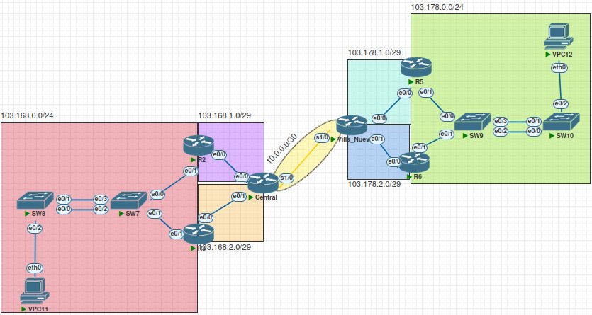

# Practica 2

## Topología

## Direcciones ip

|     **Desc.**    |    **ip**    | **subnet mask** | **deafult gateway** |
|:----------------:|:------------:|:---------------:|:-------------------:|
|       VPC11      | 103.168.0.4  |  255.255.255.0  |     103.168.0.1     |
|       VPC12      | 103.178.0.4  |  255.255.255.0  |     103.178.0.1     |
|      R2-e0/0     | 103.168.1.1  | 255.255.255.248 |          -          |
|      R2-e0/1     | 103.168.0.2  |  255.255.255.0  |          -          |
|      R3-e0/0     | 103.168.2.1  | 255.255.255.248 |          -          |
|      R3-e0/1     | 103.168.0.3  |  255.255.255.0  |          -          |
|       R2-R3      |  103.168.0.1 |        -        |          -          |
|   Central-e0/0   | 103.168.1.2  | 255.255.255.248 |          -          |
|   Central-e0/1   | 103.168.2.2  | 255.255.255.248 |          -          |
|   Central-s1/0   |   10.0.0.1   | 255.255.255.252 |          -          |
| Villa Nueva-e0/0 | 103.178.1.1  | 255.255.255.248 |          -          |
| Villa Nueva-e0/1 | 103.178.2.1  | 255.255.255.248 |          -          |
| Villa Nueva-s1/0 |   10.0.0.2   | 255.255.255.252 |          -          |
|      R5-e0/0     | 103.178.1.2  | 255.255.255.248 |          -          |
|      R5-e0/1     | 103.178.0.2  |  255.255.255.0  |          -          |
|      R6-e0/0     | 103.178.2.2  | 255.255.255.248 |          -          |
|      R6-e0/1     | 103.178.0.3  |  255.255.255.0  |          -          |
|       R5-R6      |  103.178.0.1 |        -        |          -          |

## Rangos ip para subredes

|   **subnet**   | **subnet mask** | **ip’s disponibles** | **primera ip** | **ultima ip** | **broadcast** |
|:--------------:|:---------------:|:--------------------:|:--------------:|:-------------:|:-------------:|
|   10.0.0.0/30  | 255.255.255.252 |           2          |    10.0.0.1    |    10.0.0.2   |    10.0.0.3   |
| 103.168.0.0/24 |  255.255.255.0  |          254         |   103.168.0.1  | 103.168.0.254 | 103.168.0.255 |
| 103.168.1.0/29 | 255.255.255.248 |           6          |   103.168.1.1  |  103.168.1.6  |  103.168.1.7  |
| 103.168.2.0/29 | 255.255.255.248 |           6          |   103.168.2.1  |  103.168.2.6  |  103.168.2.7  |
| 103.178.0.0/24 |  255.255.255.0  |          254         |   103.178.0.1  | 103.178.0.254 | 103.178.0.255 |
| 103.178.1.0/29 | 255.255.255.248 |           6          |   103.178.1.1  |  103.178.1.6  |  103.178.1.7  |
| 103.178.2.0/29 | 255.255.255.248 |           6          |   103.178.2.1  |  103.178.2.6  |  103.178.2.7  |

## Configuración de los dispositivos

### Central
	ena
	configure terminal
	hostname Central
	
	interface ethernet 0/0
	ip address 103.168.1.2 255.255.255.248
	no shutdown
	exit
	
	interface ethernet 0/1
	ip address 103.168.2.2 255.255.255.248
	no shutdown
	exit
	
	interface serial 1/0
	ip address 10.0.0.1 255.255.255.252
	no shutdown
	exit
	
	!Camino de e0/0
	ip route 103.168.1.0 255.255.255.248 103.168.1.1
	ip route 103.168.0.0 255.255.255.0 103.168.1.1

	!Camino de e0/1
	ip route 103.168.2.0 255.255.255.248 103.168.2.1
	ip route 103.168.0.0 255.255.255.0 103.168.2.1

	!Camino de s1/0
	ip route 103.178.1.0 255.255.255.248 10.0.0.2
	ip route 103.178.2.0 255.255.255.248 10.0.0.2
	ip route 103.178.0.0 255.255.255.0 10.0.0.2
	
	end
	
	copy running-config startup-config
	
### R2
	ena
	configure terminal
	hostname R2
	
	interface ethernet 0/1
	ip address 103.168.0.2 255.255.255.0
	no shutdown
	glbp 7 ip 103.168.0.1
	glbp 7 preempt
	glbp 7 priority 150
	glbp 7 load-balancing round-robin
	exit
	
	interface ethernet 0/0
	ip address 103.168.1.1 255.255.255.248
	no shutdown
	exit	
	
	ip route 103.168.1.0 255.255.255.248 103.168.1.2
	ip route 103.168.2.0 255.255.255.248 103.168.1.2
	ip route 10.0.0.0 255.255.255.252 103.168.1.2
	ip route 103.178.1.0 255.255.255.248 103.168.1.2
	ip route 103.178.2.0 255.255.255.248 103.168.1.2
	ip route 103.178.0.0 255.255.255.0 103.168.1.2
	
	end
	
	!Revisar configuracion
	show glbp brief
	
	copy running-config startup-config

### R5
	ena
	configure terminal
	hostname R5
	
	interface ethernet 0/0
	ip address 103.178.1.2 255.255.255.248
	no shutdown
	exit
	
	interface ethernet 0/1
	ip address 103.178.0.2 255.255.255.0
	no shutdown
	standby version 2
	standby 21 ip 103.178.0.1
	standby 21 priority 109
	standby 21 preempt
	exit
	
	ip route 103.178.1.0 255.255.255.248 103.178.1.1
	ip route 103.178.2.0 255.255.255.248 103.178.1.1
	ip route 10.0.0.0 255.255.255.252 103.178.1.1
	ip route 103.168.2.0 255.255.255.248 103.178.1.1
	ip route 103.168.1.0 255.255.255.248 103.178.1.1
	ip route 103.168.0.0 255.255.255.0 103.178.1.1
	
	end
	
	!Revisar configuracion
	show standby brief
	
	copy running-config startup-config
	
### SW7
	ena
	configure terminal
	hostname SW7
	interface range ethernet 0/0-3
	switchport trunk encapsulation dot1q 
	switchport mode trunk
	exit
	
	interface range ethernet 0/2-3
	channel-group 1 mode passive
	no shutdown
	end
	
	!Revisar la configuración
	show etherchannel summary
	show lacp neighbor
	
	copy running-config startup-config

### VPC11
	ip 103.168.0.4/24 103.168.0.1
	save

## Resumen de comandos
- Para la creación de la ruta estática se utilizo el comando ip route,
en el cual se asigna la red a la cual se quiere acceder, la mascara de subred 
y por ultimo la ip de la interfaz de salida. 
    - Por ejemplo: 103.178.1.0 255.255.255.248 103.168.1.2

- Para la creación de los portchannel primero se selecciona el rango de
interfaces que se utilizaran para la creación del puerto,
interface range ethernet 0/0-1 y se debe crear el grupo channel-group 1
y se deben poner los SW en modo activo o pasivo en el caso de SW7 y SW8
o en modo desirable o auto en el caso de SW9 y SW10.

- Para la creación de la ip virtual nos debemos colocar en la interfaz
apropiada y mediante el comando que hace referencia al protocolo crear
un grupo y escribir la ip glbp 7 ip 103.168.0.1 o standby 21 ip 103.178.0.1
y en caso de protocolo PAGP se debe seleccionar la versión standby version 2,
en cada protocolo se debe asignar una prioridad mayor al router que servirá
como maestro.

- Para las VPC ademas de asignarle la ip de la mascara de subred se le debe
asignar un gateway y este debe ser el mismo que el de la ip virtual
del router asignado.

## Comandos para verificar el funcionamiento
Para la verificación del portchannel se utilizaron los comandos:
- show etherchannel summary o show lacp neighbor
en el caso del protocolo LACP y en el caso de PAGP se deben utilizar:
- show etherchannel summary o show pagp neighbor

Para verificar la configuración de la ip virtual se puede utilizar el comando:
- show glbp brief o show standby brief, o show running-config.
O bien el comando ping para verificar la conexión entre las diferentes subredes.
