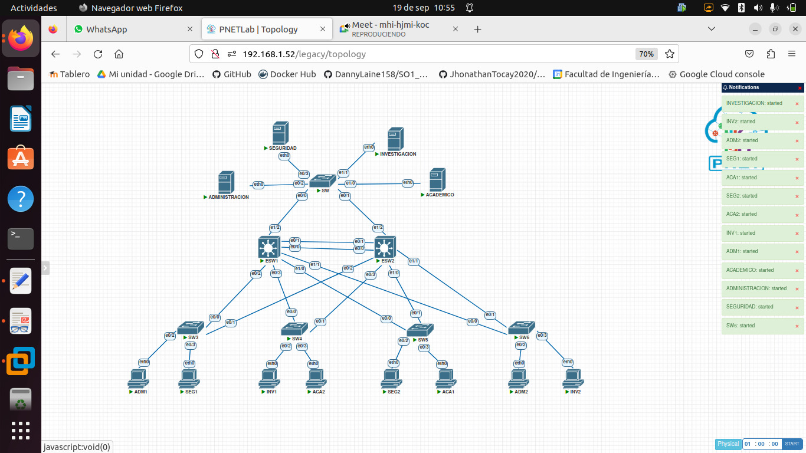
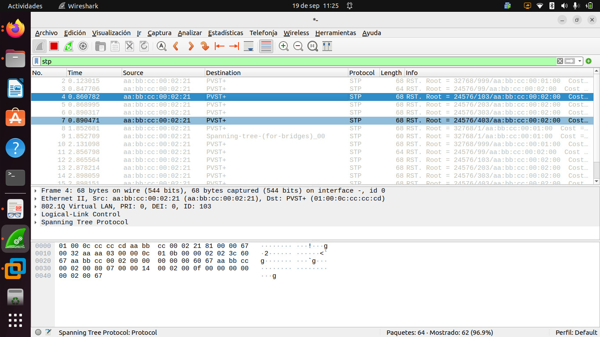
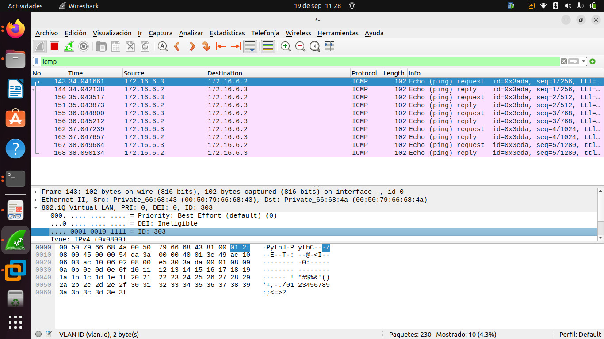

# Direcciones IP

 |  			Equipo 		     |  			Dirección IP 		 |  			Subnet mask 		   |  			Default gateway 		 |  			VLAN 		 |
|--------------|----------------|-----------------|-------------------|--------|
|  			Server ADM 		 |  			172.16.4.2 		   |  			255.255.255.0 		 |  			172.16.4.1 		      |  			103 		  |
|  			ADM1 		       |  			172.16.4.3 		   |  			255.255.255.0 		 |  			172.16.4.1 		      |  			103 		  |
|  			ADM2 		       |  			172.16.4.4 		   |  			255.255.255.0 		 |  			172.16.4.1 		      |  			103 		  |
|  			Server ACA 		 |  			172.16.5.2 		   |  			255.255.255.0 		 |  			172.16.5.1 		      |  			203 		  |
|  			ACA1 		       |  			172.16.5.3 		   |  			255.255.255.0 		 |  			172.16.5.1 		      |  			203 		  |
|  			ACA2 		       |  			172.16.5.4 		   |  			255.255.255.0 		 |  			172.16.5.1 		      |  			203 		  |
|  			Server INV 		 |  			172.16.6.2 		   |  			255.255.255.0 		 |  			172.16.6.1 		      |  			303 		  |
|  			INV1 		       |  			172.16.6.3 		   |  			255.255.255.0 		 |  			172.16.6.1 		      |  			303 		  |
|  			INV2 		       |  			172.16.6.4 		   |  			255.255.255.0 		 |  			172.16.6.1 		      |  			303 		  |
|  			Server ADM 		 |  			172.16.7.2 		   |  			255.255.255.0 		 |  			172.16.7.1 		      |  			403 		  |
|  			ADM1 		       |  			172.16.7.3 		   |  			255.255.255.0 		 |  			172.16.7.1 		      |  			403 		  |
|  			ADM2 		       |  			172.16.7.4 		   |  			255.255.255.0 		 |  			172.16.7.1 		      |  			403 		  |

# Topología

# Comandos usados

## ESW1
	enable
	
	configure terminal
	
	hostname ESW1
	
	interface range ethernet 0/0-3
	
	switchport trunk encapsulation dot1q
	
	switchport mode trunk
	
	switchport trunk native vlan 99
	
	interface range ethernet 1/0-2
	
	switchport trunk encapsulation dot1q
	
	switchport mode trunk
	
	switchport trunk native vlan 99
	
	vlan 103
	
	name Administracion
	
	vlan 203
	
	name Control Academico
	
	vlan 303
	
	name Centro de Inves
	
	vlan 403
	
	name Seguridad
	
	vlan 99
	
	name Nativa
	
	vlan 999
	
	name Blackhole
	
	interface ethernet 1/3
	
	switchport mode access
	
	switchport access vlan 999
	
	configure terminal
	
	vtp mode server
	
	vtp domain pareja03
	
	vtp password usac
	
	spanning-tree mode rapid-pvst
	
	end
	
	copy running-config startup-config
## SW5
	enable
	
	configure terminal
	
	hostname SW5
	
	interface range ethernet 0/0-1
	
	switchport trunk encapsulation dot1q
	
	switchport mode trunk
	
	switchport trunk native vlan 99
	
	vtp mode client
	
	vtp domain pareja03
	
	vtp password usac
	
	interface ethernet 0/2
	
	switchport mode access
	
	switchport access vlan 403
	
	interface ethernet 0/3
	
	switchport mode access
	
	switchport access vlan 203
	
	spanning-tree mode rapid-pvst
	
	end
	
	copy running-config startup-config
	
## SW

	enable
	
	configure terminal
	
	hostname SW
	
	interface range ethernet 0/0-1
	
	switchport trunk encapsulation dot1q
	
	switchport mode trunk
	
	switchport trunk native vlan 99
	
	vtp mode client
	
	vtp domain pareja03
	
	vtp password usac
	
	interface ethernet 0/2
	
	switchport mode access
	
	switchport access vlan 103
	
	interface ethernet 0/3
	
	switchport mode access
	
	switchport access vlan 403
	
	interface ethernet 1/0
	
	switchport mode access
	
	switchport access vlan 303
	
	interface ethernet 1/1
	
	switchport mode access
	
	switchport access vlan 203
	
	interface range ethernet 1/2-3
	
	switchport mode access
	
	switchport access vlan 999
	
	spanning-tree mode rapid-pvst
	
	end
	
	copy running-config startup-config

Figura 1: Captura de paquetes en wireshark del protocolo
STP

Figura 2: Captura en wireshark de paquete
ICMP