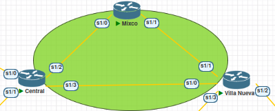

# Proyecto 2

## Tabla de IPs
| **Dispositivo o Interfaz** | **IP**        | **Máscara de subred** | **Puerta de enlace** |
|:--------------------------:|:-------------:|:---------------------:|:--------------------:|
| **Academinco**             | 172.103.2.2   | 255.255.255.224       | 172.103.2.1          |
| **Investigacion**          | 172.103.2.34  |  255.255.255.240      |  172.103.2.33        |
| **Administracion**         | 172.103.2.50  |  255.255.255.240      | 172.103.2.49         |
| **Seguridad**              | 172.103.2.66  | 255.255.255.248       | 172.103.2.65         |
| **R-Interfaz VLAN 13**     | 172.103.2.1   | 255.255.255.224       | -                    |
| **R-Interfaz VLAN 23**     |  172.103.2.33 |  255.255.255.240      | -                    |
| **R-Interfaz VLAN 33**     | 172.103.2.49  |  255.255.255.240      | -                    |
| **R-Interfaz VLAN 43**     | 172.103.2.65  | 255.255.255.248       | -                    |
| **R-e0/1**                 | 172.103.0.4   |  255.255.255.248      | -                    |
| **C_1 – e0/0**             | 172.103.0.2   |  255.255.255.248      | -                    |
| **C_1 – s1/0**             | 9.0.0.1       |  255.255.255.252      | -                    |
| **C_2 – e0/0**             | 172.103.0.3   |  255.255.255.248      | -                    |
| **C_2 – s1/0**             | 9.0.0.5       |  255.255.255.252      | -                    |
| **C_1-C_2**                | 172.103.0.1   | -                     | -                    |
| **Centra-S1/0**            | 9.0.0.2       |  255.255.255.252      | -                    |
| **Centra-S1/1**            | 9.0.0.6       |  255.255.255.252      | -                    |
| **Centra-S1/2**            | 10.0.0.5      |  255.255.255.252      | -                    |
| **Centra-S1/3**            | 10.0.0.1      |  255.255.255.252      | -                    |
| **V.Nueva-S1/0**           | 10.0.0.2      |  255.255.255.252      | -                    |
| **V.Nueva-S1/1**           | 10.0.0.9      |  255.255.255.252      | -                    |
| **V.Nueva-S1/2**           | 11.0.0.6      |  255.255.255.252      | -                    |
| **V.Nueva-S1/3**           |  11.0.0.2     |  255.255.255.252      | -                    |
| **Mixco-S1/0**             | 10.0.0.6      |  255.255.255.252      | -                    |
| **Mixco-S1/1**             | 10.0.0.10     |  255.255.255.252      | -                    |
| **ESW-e0/0**               | 173.103.0.4   |  255.255.255.248      | -                    |
| **ESW-Interfaz VLAN 13**   | 173.103.2.65  |  255.255.255.248      | -                    |
| **ESW-Interfaz VLAN 23**   | 173.103.2.33  |  255.255.255.240      | -                    |
| **ESW-Interfaz VLAN 33**   | 173.103.2.1   |  255.255.255.224      | -                    |
| **ESW-Interfaz VLAN 53**   | 173.103.2.49  |  255.255.255.240      | -                    |
| **VN_1 – e0/0**            | 173.103.0.2   |  255.255.255.248      | -                    |
| **VN_1 – s1/0**            |  11.0.0.1     |  255.255.255.252      | -                    |
| **VN_2 – e0/0**            | 173.103.0.3   |  255.255.255.248      | -                    |
| **VN_2 – s1/0**            | 11.0.0.5      |  255.255.255.252      | -                    |
| **VN_1-VN_2**              | 173.103.0.1   | -                     | -                    |
| **ACA_1**                  | 173.103.2.2   |  255.255.255.224      | 173.103.2.1          |
| **INVES_1**                | 173.103.2.50  |  255.255.255.240      | 173.103.2.49         |
| **ADMIN_1**                | 173.103.2.66  |  255.255.255.248      | 173.103.2.65         |
| **SEGU_1**                 | 173.103.2.34  |  255.255.255.240      | 173.103.2.33         |

## Subredes VLAN en la Central
| **VLAN**           | **Equipos** | **ID de red** | **Mascara de subred** | **Primer host** | **Ultimo host** | **Broadcast** |
|:------------------:|:-----------:|:-------------:|:---------------------:|:---------------:|:---------------:|:-------------:|
| **Academico**      | 21          | 172.103.2.0   | 255.255.255.224       | 172.103.2.1     | 172.103.2.30    | 172.103.2.31  |
| **Investigacion**  | 12          | 172.103.2.32  |  255.255.255.240      |  172.103.2.33   | 172.103.2.46    | 172.103.2.47  |
| **Administracion** | 9           | 172.103.2.48  | 255.255.255.240       | 172.103.2.49    | 172.103.2.62    |  172.103.2.63 |
| **Seguridad**      | 4           |  172.103.2.64 | 255.255.255.248       | 172.103.2.65    | 172.103.2.70    |  172.103.2.71 |

## Subredes VLAN en Villa Nueva
| **VLAN**           | **Equipos** | **ID de red** | **Mascara de subred** | **Primer host** | **Ultimo host** | **Broadcast** |
|:------------------:|:-----------:|:-------------:|:---------------------:|:---------------:|:---------------:|:-------------:|
| **Academico**      | 18          | 173.103.2.0   |  255.255.255.224      | 173.103.2.1     | 173.103.2.30    | 173.103.2.31  |
| **Seguridad**      | 12          | 173.103.2.32  |  255.255.255.240      | 173.103.2.33    | 173.103.2.46    | 173.103.2.47  |
| **Investigacion**  | 7           | 173.103.2.48  |  255.255.255.240      | 173.103.2.49    | 173.103.2.62    |  173.103.2.63 |
| **Administracion** | 3           |  173.103.2.64 |  255.255.255.248      | 173.103.2.65    | 173.103.2.70    | 173.103.2.71  |

## Subredes de las Interfaces de los routers
| **Equipo**          | **Interfaces** | **ID de red** | **Mascara de subred** | **Primer host** | **Ultimo host** | **Broadcast** |
|:-------------------:|:--------------:|:-------------:|:---------------------:|:---------------:|:---------------:|:-------------:|
| **C_1**             | 2              | 9.0.0.0       |  255.255.255.252      |  9.0.0.1        |  9.0.0.2        | 9.0.0.3       |
| **C_2**             | 2              | 9.0.0.4       | 255.255.255.252       | 9.0.0.5         | 9.0.0.6         |  9.0.0.7      |
| **Central-V.Nueva** | 2              | 10.0.0.0      |  255.255.255.252      | 10.0.0.1        | 10.0.0.2        | 10.0.0.3      |
| **Central-Mixco**   | 2              | 10.0.0.4      |  255.255.255.252      | 10.0.0.5        | 10.0.0.6        | 10.0.0.7      |
| **Mixco-V.Nueva**   | 2              | 10.0.0.8      |  255.255.255.252      | 10.0.0.9        | 10.0.0.10       | 10.0.0.11     |
| **VN_1**            | 2              | 11.0.0.0      |  255.255.255.252      |  11.0.0.1       |  11.0.0.2       | 11.0.0.3      |
| **VN_2**            | 2              | 11.0.0.4      | 255.255.255.252       | 11.0.0.5        | 11.0.0.6        |  11.0.0.7     |

## Procedimiento realizado para calcular el VLSM de Central
1. Se ordenaron las VLANs en orden descente dependiendo la cantidad de equipos que debe ser capaz de almacenar.

2. Se construyo una tabla en una hoja de calculo de 7 columnas y 5 filas (La primera para el encabezado).

3. Se empezo el procedimiento poniendole como ID de red a la VLAN con la cantidad de dispositivos más grande la Ip con el último octeto con un valor de 0 (172.103.2.0).

4. Mediante una herramienta en linea se calcula la cantidad de host disponibles para diferentes mascaras de subred, hasta encontrar la que tuviera de host disponibles que fuera igual o mayor a la cantidad de equipos, en el caso de la segunda opción, se busca que fuera la más próxima posible a la cantidad de equipos de la VLAN.

5. Una vez encontrada la máscara de subred, se calcula el primero y último host disponibles y el el broadcast de la red.

6. A la siguiente VLAN del listado se le pone de ID de red la Ip que se encuentra directamente después a la dirección de Broadcast de la VLAN que estamos calculando.

7. Se repite el proceso 4-6 para las siguientes VLAN hasta haber cubierto todas las VLAN de la red de la Central.

## Procedimiento realizado para calcular el FLSM de Core

1. Ya que cada subred debe tener la misma cantidad de host disponibles y para el funcionamiento del Core cada conexión entre routers deben haber 2 Ip disponibles como minímo, por lo tanto, se establecio que para todas las subredes se usaría la mascara de subred 255.255.255.252.

2. Se empezó el procedimiento calculando la subred de la conexión entre el router Central y Villa Nueva, poniendole como ID red la Ip con el último octeto con un valor de 0 (10.0.0.0).

3. Se calculo el primer y último host disponibles y el broadcast de la primera subred.

4. A la siguiente subred del listado se le pone de ID de red la Ip que se encuentra directamente después a la dirección de Broadcast de la subred que estamos calculando.

5. Se repite el proceso 3-4 para las siguientes VLAN hasta haber cubierto todas las VLAN de la red del Core.

## Imagenes de la topología

### Sede Central

### Conexión Sede Central con el Core

### Core

### Sede Villa Nueva

### Conexión Sede Villa Nueva con el Core
